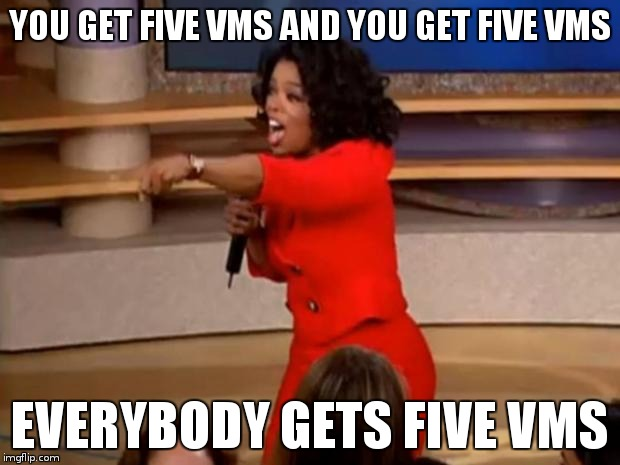

# Pre-requirements

- Computer with internet connection and a web browser

- For instructor-led workshops: an SSH client to connect to remote machines

  - on Linux, OS X, FreeBSD... you are probably all set

  - on Windows, get [putty](http://www.putty.org/),
  Microsoft [Win32 OpenSSH](https://github.com/PowerShell/Win32-OpenSSH/wiki/Install-Win32-OpenSSH),
  [Git BASH](https://git-for-windows.github.io/), or
  [MobaXterm](http://mobaxterm.mobatek.net/)

- A tiny little bit of Docker knowledge

  (that's totally OK if you're not a Docker expert!)

---

class: in-person, extra-details

## Nice-to-haves

- [Mosh](https://mosh.org/) instead of SSH, if your internet connection tends to lose packets
  <br/>(available with `(apt|yum|brew) install mosh`; then connect with `mosh user@host`)

- [GitHub](https://github.com/join) account
  <br/>(if you want to fork the repo)

- [Slack](https://community.docker.com/registrations/groups/4316) account
  <br/>(to join the conversation after the workshop)

- [Docker Hub](https://hub.docker.com) account
  <br/>(it's one way to distribute images on your cluster)

---

class: extra-details

## Extra details

- This slide should have a little magnifying glass in the top left corner

  (If it doesn't, it's because CSS is hard — Jérôme is only a backend person, alas)

- Slides with that magnifying glass indicate slides providing extra details

- Feel free to skip them if you're in a hurry!

---

## Hands-on sections

- The whole workshop is hands-on

- We will see Docker and Kubernetes in action

- You are invited to reproduce all the demos

- All hands-on sections are clearly identified, like the gray rectangle below

.exercise[

- This is the stuff you're supposed to do!
- Go to [container.training](http://container.training/) to view these slides
- Join the chat room on @@CHAT@@

]

---

class: pic, in-person



---

class: in-person

## You get five VMs

- Each person gets 5 private VMs (not shared with anybody else)
- Kubernetes has been deployed and pre-configured on these machines
- They'll remain up until the day after the tutorial
- You should have a little card with login+password+IP addresses
- You can automatically SSH from one VM to another

.exercise[

<!--
```bash
for N in $(seq 1 5); do
  ssh -o StrictHostKeyChecking=no node$N true
done
```
-->

- Log into the first VM (`node1`) with SSH or MOSH
- Check that you can SSH (without password) to `node2`:
  ```bash
  ssh node2
  ```
- Type `exit` or `^D` to come back to node1

<!--
```keys
exit
```
-->

]

---

## We will (mostly) interact with node1 only

- Unless instructed, **all commands must be run from the first VM, `node1`**

- We will only checkout/copy the code on `node1`

- During normal operations, we do not need access to the other nodes

- If we had to troubleshoot issues, we would use a combination of:

  - SSH (to access system logs, daemon status...)
  
  - Docker API (to check running containers and container engine status)

---

## Terminals

Once in a while, the instructions will say:
<br/>"Open a new terminal."

There are multiple ways to do this:

- create a new window or tab on your machine, and SSH into the VM;

- use screen or tmux on the VM and open a new window from there.

You are welcome to use the method that you feel the most comfortable with.

---

## Tmux cheatsheet

- Ctrl-b c → creates a new window
- Ctrl-b n → go to next window
- Ctrl-b p → go to previous window
- Ctrl-b " → split window top/bottom
- Ctrl-b % → split window left/right
- Ctrl-b Alt-1 → rearrange windows in columns
- Ctrl-b Alt-2 → rearrange windows in rows
- Ctrl-b arrows → navigate to other windows
- Ctrl-b d → detach session
- tmux attach → reattach to session
