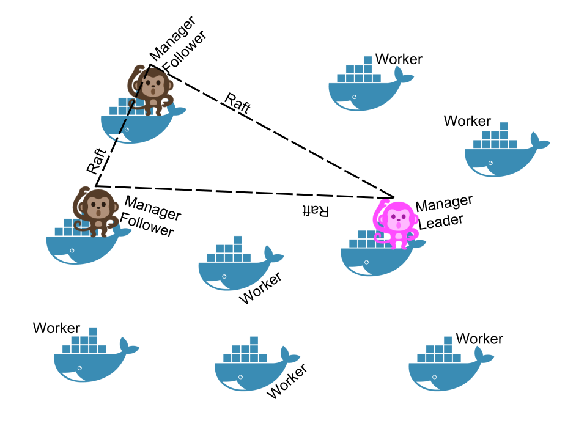
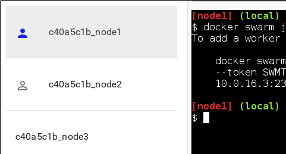

# SwarmKit

- [SwarmKit](https://github.com/docker/swarmkit) is an open source
  toolkit to build multi-node systems

- It is a reusable library, like libcontainer, libnetwork, vpnkit ...

- It is a plumbing part of the Docker ecosystem

---

## SwarmKit features

- Highly-available, distributed store based on [Raft](
  https://en.wikipedia.org/wiki/Raft_%28computer_science%29)
  <br/>(avoids depending on an external store: easier to deploy; higher performance)

- Dynamic reconfiguration of Raft without interrupting cluster operations

- *Services* managed with a *declarative API*
  <br/>(implementing *desired state* and *reconciliation loop*)

- Integration with overlay networks and load balancing

- Strong emphasis on security:

  - automatic TLS keying and signing; automatic cert rotation
  - full encryption of the data plane; automatic key rotation
  - least privilege architecture (single-node compromise ≠ cluster compromise)
  - on-disk encryption with optional passphrase

---

class: extra-details

## Where is the key/value store?

- Many orchestration systems use a key/value store backed by a consensus algorithm
  <br/>
  (k8s→etcd→Raft, mesos→zookeeper→ZAB, etc.)

- SwarmKit implements the Raft algorithm directly
  <br/>
  (Nomad is similar; thanks [@cbednarski](https://twitter.com/@cbednarski),
  [@diptanu](https://twitter.com/diptanu) and others for point it out!)

- Analogy courtesy of [@aluzzardi](https://twitter.com/aluzzardi):

  *It's like B-Trees and RDBMS. They are different layers, often
  associated. But you don't need to bring up a full SQL server when
  all you need is to index some data.*

- As a result, the orchestrator has direct access to the data
  <br/>
  (the main copy of the data is stored in the orchestrator's memory)

- Simpler, easier to deploy and operate; also faster

---

## SwarmKit concepts (1/2)

- A *cluster* will be at least one *node* (preferably more)

- A *node* can be a *manager* or a *worker*

- A *manager* actively takes part in the Raft consensus, and keeps the Raft log

- You can talk to a *manager* using the SwarmKit API

- One *manager* is elected as the *leader*; other managers merely forward requests to it

- The *workers* get their instructions from the *managers*

- Both *workers* and *managers* can run containers

---

## Illustration



---

## SwarmKit concepts (2/2)

- The *managers* expose the SwarmKit API

- Using the API, you can indicate that you want to run a *service*

- A *service* is specified by its *desired state*: which image, how many instances...

- The *leader* uses different subsystems to break down services into *tasks*:
  <br/>orchestrator, scheduler, allocator, dispatcher

- A *task* corresponds to a specific container, assigned to a specific *node*

- *Nodes* know which *tasks* should be running, and will start or stop containers accordingly (through the Docker Engine API)

You can refer to the [NOMENCLATURE](https://github.com/docker/swarmkit/blob/master/design/nomenclature.md) in the SwarmKit repo for more details.

---

## Swarm Mode

- Since version 1.12, Docker Engine embeds SwarmKit

- All the SwarmKit features are "asleep" until you enable "Swarm Mode"

- Examples of Swarm Mode commands:

  - `docker swarm` (enable Swarm mode; join a Swarm; adjust cluster parameters)

  - `docker node` (view nodes; promote/demote managers; manage nodes)

  - `docker service` (create and manage services)

???

- The Docker API exposes the same concepts

- The SwarmKit API is also exposed (on a separate socket)

---

## You need to enable Swarm mode to use the new stuff

- By default, all this new code is inactive

- Swarm Mode can be enabled, "unlocking" SwarmKit functions
  <br/>(services, out-of-the-box overlay networks, etc.)

.exercise[

- Try a Swarm-specific command:
  ```bash
  docker node ls
  ```

]

--

You will get an error message:
```
Error response from daemon: This node is not a swarm manager. [...]
```

---

# Creating our first Swarm

- The cluster is initialized with `docker swarm init`

- This should be executed on a first, seed node

- .warning[DO NOT execute `docker swarm init` on multiple nodes!]

  You would have multiple disjoint clusters.

.exercise[

- Create our cluster from node1:
  ```bash
  docker swarm init
  ```

]

--

class: advertise-addr

If Docker tells you that it `could not choose an IP address to advertise`, see next slide!

---

class: advertise-addr

## IP address to advertise

- When running in Swarm mode, each node *advertises* its address to the others
  <br/>
  (i.e. it tells them *"you can contact me on 10.1.2.3:2377"*)

- If the node has only one IP address (other than 127.0.0.1), it is used automatically

- If the node has multiple IP addresses, you **must** specify which one to use
  <br/>
  (Docker refuses to pick one randomly)

- You can specify an IP address or an interface name
  <br/>(in the latter case, Docker will read the IP address of the interface and use it)

- You can also specify a port number
  <br/>(otherwise, the default port 2377 will be used)

---

class: advertise-addr

## Which IP address should be advertised?

- If your nodes have only one IP address, it's safe to let autodetection do the job

  .small[(Except if your instances have different private and public addresses, e.g.
  on EC2, and you are building a Swarm involving nodes inside and outside the
  private network: then you should advertise the public address.)]

- If your nodes have multiple IP addresses, pick an address which is reachable
  *by every other node* of the Swarm

- If you are using [play-with-docker](http://play-with-docker.com/), use the IP
  address shown next to the node name

  .small[(This is the address of your node on your private internal overlay network.
  The other address that you might see is the address of your node on the
  `docker_gwbridge` network, which is used for outbound traffic.)]

Examples:

```bash
docker swarm init --advertise-addr 10.0.9.2
docker swarm init --advertise-addr eth0:7777
```

---

class: extra-details

## Using a separate interface for the data path

- You can use different interfaces (or IP addresses) for control and data

- You set the _control plane path_ with `--advertise-addr`

  (This will be used for SwarmKit manager/worker communication, leader election, etc.)

- You set the _data plane path_ with `--data-path-addr`

  (This will be used for traffic between containers)

- Both flags can accept either an IP address, or an interface name

  (When specifying an interface name, Docker will use its first IP address)

---

## Token generation

- In the output of `docker swarm init`, we have a message
  confirming that our node is now the (single) manager:

  ```
  Swarm initialized: current node (8jud...) is now a manager.
  ```

- Docker generated two security tokens (like passphrases or passwords) for our cluster

- The CLI shows us the command to use on other nodes to add them to the cluster using the "worker"
  security token:

  ```
    To add a worker to this swarm, run the following command:
      docker swarm join \
      --token SWMTKN-1-59fl4ak4nqjmao1ofttrc4eprhrola2l87... \
      172.31.4.182:2377
  ```

---

class: extra-details

## Checking that Swarm mode is enabled

.exercise[

- Run the traditional `docker info` command:
  ```bash
  docker info
  ```

]

The output should include:

```
Swarm: active
 NodeID: 8jud7o8dax3zxbags3f8yox4b
 Is Manager: true
 ClusterID: 2vcw2oa9rjps3a24m91xhvv0c
 ...
```

---

## Running our first Swarm mode command

- Let's retry the exact same command as earlier

.exercise[

- List the nodes (well, the only node) of our cluster:
  ```bash
  docker node ls
  ```

]

The output should look like the following:
```
ID             HOSTNAME  STATUS  AVAILABILITY  MANAGER STATUS
8jud...ox4b *  node1     Ready   Active        Leader
```

---

## Adding nodes to the Swarm

- A cluster with one node is not a lot of fun

- Let's add `node2`!

- We need the token that was shown earlier

--

- You wrote it down, right?

--

- Don't panic, we can easily see it again 😏

---

## Adding nodes to the Swarm

.exercise[

- Show the token again:
  ```bash
  docker swarm join-token worker
  ```

- Switch to `node2`

- Copy-paste the `docker swarm join ...` command
  <br/>(that was displayed just before)

]

---

class: extra-details

## Check that the node was added correctly

- Stay on `node2` for now!

.exercise[

- We can still use `docker info` to verify that the node is part of the Swarm:
  ```bash
  docker info | grep ^Swarm
  ```

]

- However, Swarm commands will not work; try, for instance:
  ```
  docker node ls
  ```

- This is because the node that we added is currently a *worker*

- Only *managers* can accept Swarm-specific commands

---

## View our two-node cluster

- Let's go back to `node1` and see what our cluster looks like

.exercise[

- Switch back to `node1`

- View the cluster from `node1`, which is a manager:
  ```bash
  docker node ls
  ```

]

The output should be similar to the following:
```
ID             HOSTNAME  STATUS  AVAILABILITY  MANAGER STATUS
8jud...ox4b *  node1     Ready   Active        Leader
ehb0...4fvx    node2     Ready   Active
```

---

class: docker-machine

## Adding nodes using the Docker API

- We don't have to SSH into the other nodes, we can use the Docker API

- If you are using Play-With-Docker:

  - the nodes expose the Docker API over port 2375/tcp, without authentication

  - we will connect by setting the `DOCKER_HOST` environment variable

- Otherwise:

  - the nodes expose the Docker API over port 2376/tcp, with TLS mutual authentication

  - we will use Docker Machine to set the correct environment variables
    <br/>(the nodes have been suitably pre-configured to be controlled through `node1`)

---

class: docker-machine

# Docker Machine

- Docker Machine has two primary uses:

  - provisioning cloud instances running the Docker Engine

  - managing local Docker VMs within e.g. VirtualBox

- Docker Machine is purely optional

- It makes it easy to create, upgrade, manage... Docker hosts:

  - on your favorite cloud provider

  - locally (e.g. to test clustering, or different versions)

  - across different cloud providers

---

class: self-paced, docker-machine

## If you're using Play-With-Docker ...

- You won't need to use Docker Machine

- Instead, to "talk" to another node, we'll just set `DOCKER_HOST`

- You can skip the exercises telling you to do things with Docker Machine!

---

class: docker-machine

## Docker Machine basic usage

- We will learn two commands:

  - `docker-machine ls` (list existing hosts)

  - `docker-machine env` (switch to a specific host)

.exercise[

- List configured hosts:
  ```bash
  docker-machine ls
  ```

]

You should see your 5 nodes.

---

class: in-person, docker-machine

## How did we make our 5 nodes show up there?

*For the curious...*

- This was done by our VM provisioning scripts

- After setting up everything else, `node1` adds the 5 nodes
  to the local Docker Machine configuration
  (located in `$HOME/.docker/machine`)

- Nodes are added using [Docker Machine generic driver](https://docs.docker.com/machine/drivers/generic/)

  (It skips machine provisioning and jumps straight to the configuration phase)

- Docker Machine creates TLS certificates and deploys them to the nodes through SSH

---

class: docker-machine

## Using Docker Machine to communicate with a node

- To select a node, use `eval $(docker-machine env nodeX)`

- This sets a number of environment variables

- To unset these variables, use `eval $(docker-machine env -u)`

.exercise[

- View the variables used by Docker Machine:
  ```bash
  docker-machine env node3
  ```

]

(This shows which variables *would* be set by Docker Machine; but it doesn't change them.)

---

class: docker-machine

## Getting the token

- First, let's store the join token in a variable

- This must be done from a manager

.exercise[

- Make sure we talk to the local node, or `node1`:
  ```bash
  eval $(docker-machine env -u)
  ```

- Get the join token:
  ```bash
  TOKEN=$(docker swarm join-token -q worker)
  ```

]

---

class: docker-machine

## Change the node targeted by the Docker CLI

- We need to set the right environment variables to communicate with `node3`

.exercise[

- If you're using Play-With-Docker:
  ```bash
  export DOCKER_HOST=tcp://node3:2375
  ```

- Otherwise, use Docker Machine:
  ```bash
  eval $(docker-machine env node3)
  ```

]

---

class: docker-machine

## Checking which node we're talking to

- Let's use the Docker API to ask "who are you?" to the remote node

.exercise[

- Extract the node name from the output of `docker info`:
  ```bash
  docker info | grep ^Name
  ```

]

This should tell us that we are talking to `node3`.

Note: it can be useful to use a [custom shell prompt](
https://github.com/jpetazzo/orchestration-workshop/blob/master/prepare-vms/scripts/postprep.rc#L68)
reflecting the `DOCKER_HOST` variable.

---

class: docker-machine

## Adding a node through the Docker API

- We are going to use the same `docker swarm join` command as before

.exercise[

- Add `node3` to the Swarm:
  ```bash
  docker swarm join --token $TOKEN node1:2377
  ```

]

---

class: docker-machine

## Going back to the local node

- We need to revert the environment variable(s) that we had set previously

.exercise[

- If you're using Play-With-Docker, just clear `DOCKER_HOST`:
  ```bash
  unset DOCKER_HOST
  ```

- Otherwise, use Docker Machine to reset all the relevant variables:
  ```bash
  eval $(docker-machine env -u)
  ```

]

From that point, we are communicating with `node1` again.

---

class: docker-machine

## Checking the composition of our cluster

- Now that we're talking to `node1` again, we can use management commands

.exercise[

- Check that the node is here:
  ```bash
  docker node ls
  ```

]

---

class: under-the-hood

## Under the hood: docker swarm init

When we do `docker swarm init`:

- a keypair is created for the root CA of our Swarm

- a keypair is created for the first node

- a certificate is issued for this node

- the join tokens are created

---

class: under-the-hood

## Under the hood: join tokens

There is one token to *join as a worker*, and another to *join as a manager*.

The join tokens have two parts:

- a secret key (preventing unauthorized nodes from joining)

- a fingerprint of the root CA certificate (preventing MITM attacks)

If a token is compromised, it can be rotated instantly with:
```
docker swarm join-token --rotate <worker|manager>
```

---

class: under-the-hood

## Under the hood: docker swarm join

When a node joins the Swarm:

- it is issued its own keypair, signed by the root CA

- if the node is a manager:

  - it joins the Raft consensus
  - it connects to the current leader
  - it accepts connections from worker nodes

- if the node is a worker:

  - it connects to one of the managers (leader or follower)

---

class: under-the-hood

## Under the hood: cluster communication

- The *control plane* is encrypted with AES-GCM; keys are rotated every 12 hours

- Authentication is done with mutual TLS; certificates are rotated every 90 days

  (`docker swarm update` allows to change this delay or to use an external CA)

- The *data plane* (communication between containers) is not encrypted by default

  (but this can be activated on a by-network basis, using IPSEC,
  leveraging hardware crypto if available)

---

class: under-the-hood

## Under the hood: I want to know more!

Revisit SwarmKit concepts:

- Docker 1.12 Swarm Mode Deep Dive Part 1: Topology
  ([video](https://www.youtube.com/watch?v=dooPhkXT9yI))

- Docker 1.12 Swarm Mode Deep Dive Part 2: Orchestration
  ([video](https://www.youtube.com/watch?v=_F6PSP-qhdA))

Some presentations from the Docker Distributed Systems Summit in Berlin:

- Heart of the SwarmKit: Topology Management
  ([slides](https://speakerdeck.com/aluzzardi/heart-of-the-swarmkit-topology-management))

- Heart of the SwarmKit: Store, Topology & Object Model
  ([slides](http://www.slideshare.net/Docker/heart-of-the-swarmkit-store-topology-object-model))
  ([video](https://www.youtube.com/watch?v=EmePhjGnCXY))

---

## Adding more manager nodes

- Right now, we have only one manager (node1)

- If we lose it, we lose quorum - and that's *very bad!*

- Containers running on other nodes will be fine ...

- But we won't be able to get or set anything related to the cluster

- If the manager is permanently gone, we will have to do a manual repair!

- Nobody wants to do that ... so let's make our cluster highly available

---

class: self-paced

## Adding more managers

With Play-With-Docker:

```bash
TOKEN=$(docker swarm join-token -q manager)
for N in $(seq 4 5); do
  export DOCKER_HOST=tcp://node$N:2375
  docker swarm join --token $TOKEN node1:2377
done
unset DOCKER_HOST
```

---

class: docker-machine

## Adding more managers

With Docker Machine:

```bash
TOKEN=$(docker swarm join-token -q manager)
for N in $(seq 4 5); do
  eval $(docker-machine env node$N)
  docker swarm join --token $TOKEN node1:2377
done
eval $(docker-machine env -u)
```

---

class: in-person

## Building our full cluster

- We could SSH to nodes 3, 4, 5; and copy-paste the command

--

class: in-person

- Or we could use the AWESOME POWER OF THE SHELL!

--

class: in-person


--

class: in-person

- No, not *that* shell

---

class: in-person

## Let's form like Swarm-tron

- Let's get the token, and loop over the remaining nodes with SSH

.exercise[

- Obtain the manager token:
  ```bash
  TOKEN=$(docker swarm join-token -q manager)
  ```

- Loop over the 3 remaining nodes:
  ```bash
    for NODE in node3 node4 node5; do
      ssh $NODE docker swarm join --token $TOKEN node1:2377
    done
  ```

]

[That was easy.](https://www.youtube.com/watch?v=3YmMNpbFjp0)

---

## You can control the Swarm from any manager node

.exercise[

- Try the following command on a few different nodes:
  ```bash
  docker node ls
  ```

]

On manager nodes:
<br/>you will see the list of nodes, with a `*` denoting
the node you're talking to.

On non-manager nodes:
<br/>you will get an error message telling you that
the node is not a manager.

As we saw earlier, you can only control the Swarm through a manager node.

---

class: self-paced

## Play-With-Docker node status icon

- If you're using Play-With-Docker, you get node status icons

- Node status icons are displayed left of the node name

  - No icon = no Swarm mode detected
  - Solid blue icon = Swarm manager detected
  - Blue outline icon = Swarm worker detected



---

## Dynamically changing the role of a node

- We can change the role of a node on the fly:

  `docker node promote XXX` → make XXX a manager
  <br/>
  `docker node demote XXX` → make XXX a worker

.exercise[

- See the current list of nodes:
  ```
  docker node ls
  ```

- Promote any worker node to be a manager:
  ```
  docker node promote <node_name_or_id>
  ```

]

---

## How many managers do we need?

- 2N+1 nodes can (and will) tolerate N failures
  <br/>(you can have an even number of managers, but there is no point)

--

- 1 manager = no failure

- 3 managers = 1 failure

- 5 managers = 2 failures (or 1 failure during 1 maintenance)

- 7 managers and more = now you might be overdoing it a little bit

---

## Why not have *all* nodes be managers?

- Intuitively, it's harder to reach consensus in larger groups

- With Raft, writes have to go to (and be acknowledged by) all nodes

- More nodes = more network traffic

- Bigger network = more latency

---

## What would McGyver do?

- If some of your machines are more than 10ms away from each other,
  <br/>
  try to break them down in multiple clusters
  (keeping internal latency low)

- Groups of up to 9 nodes: all of them are managers

- Groups of 10 nodes and up: pick 5 "stable" nodes to be managers
  <br/>
  (Cloud pro-tip: use separate auto-scaling groups for managers and workers)

- Groups of more than 100 nodes: watch your managers' CPU and RAM

- Groups of more than 1000 nodes:

  - if you can afford to have fast, stable managers, add more of them
  - otherwise, break down your nodes in multiple clusters

---

## What's the upper limit?

- We don't know!

- Internal testing at Docker Inc.: 1000-10000 nodes is fine

  - deployed to a single cloud region

  - one of the main take-aways was *"you're gonna need a bigger manager"*

- Testing by the community: [4700 heterogenous nodes all over the 'net](https://sematext.com/blog/2016/11/14/docker-swarm-lessons-from-swarm3k/)

  - it just works

  - more nodes require more CPU; more containers require more RAM

  - scheduling of large jobs (70000 containers) is slow, though (working on it!)

---

## Real-life deployment methods

-- Running commands manually over SSH

--

  (lol jk)

--

- Using your favorite configuration management tool

- [Docker for AWS](https://docs.docker.com/docker-for-aws/#quickstart)

- [Docker for Azure](https://docs.docker.com/docker-for-azure/)
