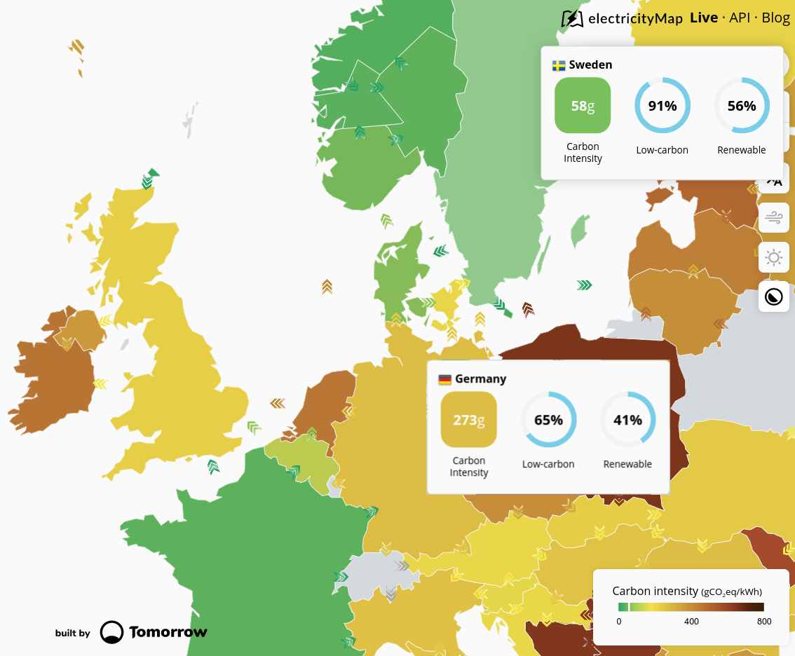

class: pic

---

## Our VMs are low-carbon

- The closest EC2 region to Berlin is eu-central-1

  (Frankfurt; Germany electricity mix: wind, coal, nuclear, gas)

- Instead, we deployed these VMs in eu-north-1

  (Stockholm; Sweden electricity mix: hydro, nuclear, wind)

- According to [Electricity Map](https://electricitymap.org/), they produce ~5x less carbon

  (at least Monday morning, when the VMs were deployed)

- The latency was a bit higher; let me know if you saw any difference!

