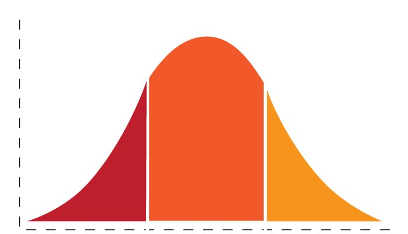

## Intros

- Hello! I'm Jérôme Petazzoni ([@jpetazzo](https://twitter.com/jpetazzo))

- The workshop will run from 9am to noon (Pacific time)

- There will be a short break around 10:30am

- I can't hear, read, or see you ... but I'm helped by folks who can!

- Make sure to join the Slack channel (@@CHAT@@)

- Feel free to ask questions at any time there!

- Your questions will be either answered, or relayed to me ✨

---

## Let's help each other

- If someone asks a question and you know the answer, please chime in!
